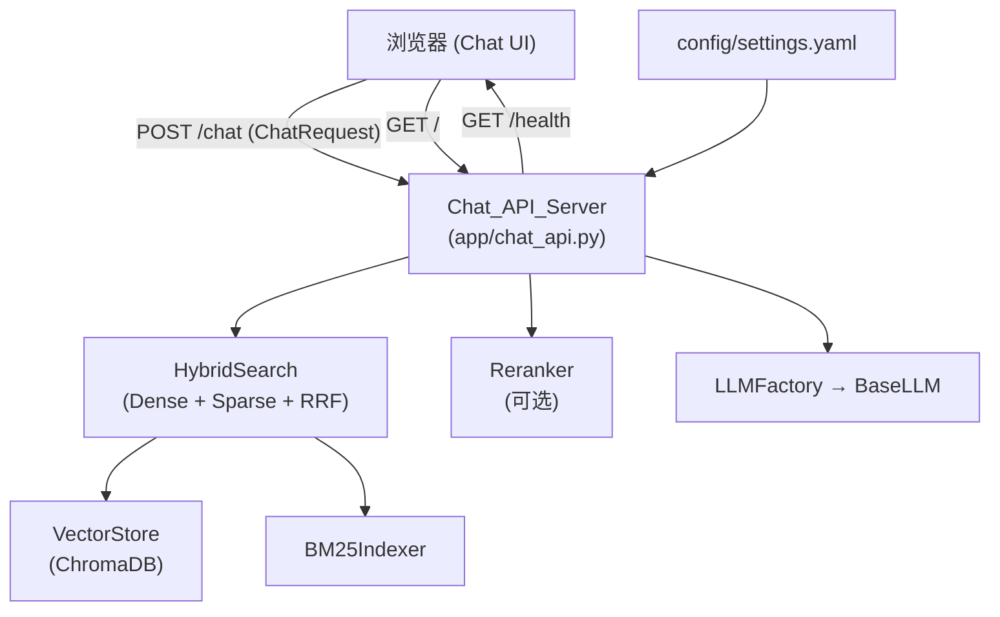
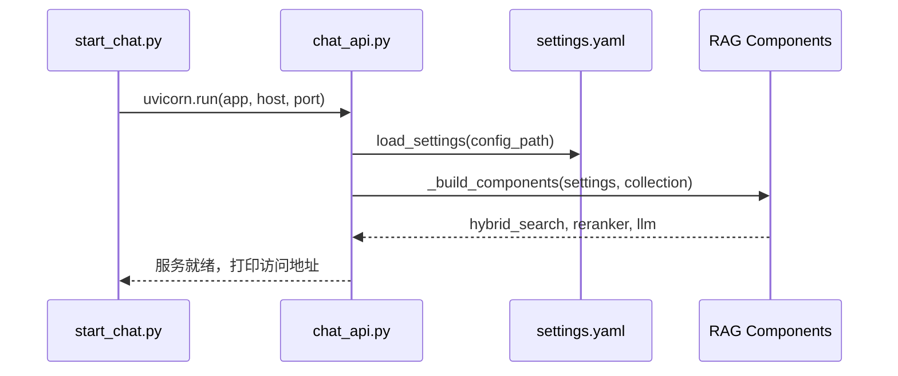
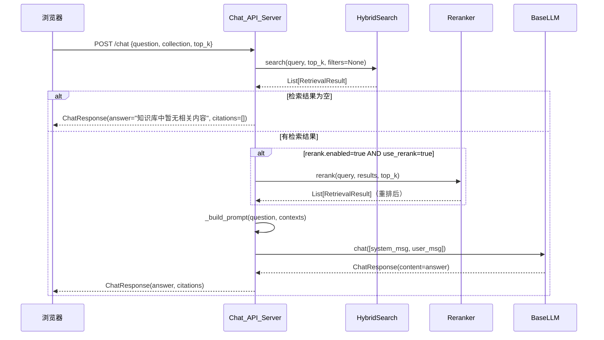

# 技术设计文档：Chat UI

## 概述

本文档描述为 Modular RAG MCP Server 新增浏览器对话界面（Chat UI）的技术设计方案。

系统由三个新增文件构成：
- `app/chat_api.py`：FastAPI 应用，提供 `/chat`、`/health`、`/` 三个接口
- `app/static/index.html`：单文件静态前端，无构建依赖
- `scripts/start_chat.py`：服务启动入口

后端完全复用现有的 `HybridSearch`、`Reranker`、`LLMFactory` 组件，执行完整的 RAG 链路（检索 → 可选重排 → LLM 生成）。

---

## 架构



**启动流程：**



---

## 组件与接口

### FastAPI 应用（`app/chat_api.py`）

```
ChatAPIApp
├── lifespan()              # 启动时初始化组件，关闭时清理
├── GET  /                  # 返回 index.html 静态文件
├── GET  /health            # 返回服务状态和组件信息
└── POST /chat              # 执行 RAG 链路，返回 ChatResponse

_build_components(settings, collection)  # 复用 scripts/query.py 的同名函数
_run_rag_pipeline(query, collection, top_k, use_rerank)  # RAG 执行逻辑
_build_prompt(query, contexts)           # 构造 LLM Prompt
```

### 接口规范

**`POST /chat`**
- 请求体：`ChatRequest`
- 响应体：`ChatResponse`
- 错误：HTTP 500 + `ErrorResponse`

**`GET /health`**
- 响应体：`HealthResponse`

**`GET /`**
- 响应：`text/html`，返回 `app/static/index.html` 内容

---

## 数据模型

```python
from pydantic import BaseModel, Field
from typing import List, Optional

class ChatRequest(BaseModel):
    question: str = Field(..., min_length=1, description="用户问题")
    collection: str = Field(default="default", description="知识库集合名称")
    top_k: Optional[int] = Field(default=None, description="检索数量，None 时使用配置文件默认值")
    use_rerank: bool = Field(default=True, description="是否启用重排序（仍受配置文件约束）")

class Citation(BaseModel):
    source: str = Field(..., description="文档路径（来自 metadata.source_path）")
    score: float = Field(..., description="相关性分数")
    text: str = Field(..., description="原文片段，截取前 200 字符")

class ChatResponse(BaseModel):
    answer: str = Field(..., description="LLM 生成的自然语言回答")
    citations: List[Citation] = Field(default_factory=list, description="引用来源列表")

class HealthResponse(BaseModel):
    status: str  # "ok"
    components: dict  # {"hybrid_search": bool, "reranker": bool, "llm": bool}

class ErrorResponse(BaseModel):
    error: str  # 可读的错误描述，不含堆栈信息
```

> 注意：`src/libs/llm/base_llm.py` 中已有同名 `ChatResponse` 数据类，本文档中的 `ChatResponse` 是 Pydantic 模型，用于 HTTP 响应序列化，两者不冲突（位于不同模块）。

---

## RAG Pipeline 流程



### Prompt 构造策略

```
系统消息（system）：
  你是一个知识库问答助手。请严格基于以下提供的上下文内容回答用户问题。
  如果上下文中没有足够信息，请明确告知用户，不要凭空捏造。

用户消息（user）：
  上下文：
  [1] {text_snippet_1}
  [2] {text_snippet_2}
  ...

  问题：{question}
```

---

## 前端设计（`app/static/index.html`）

单文件 HTML，内联 CSS 和 JavaScript，无外部依赖。

### HTML 结构

```
<body>
  <div id="app">
    <header>Chat UI - RAG 知识库对话</header>
    <div id="config-bar">
      <input id="collection-input" value="default" />  <!-- 集合选择 -->
    </div>
    <div id="chat-area">                               <!-- 对话区域，overflow-y: auto -->
      <!-- 动态插入消息气泡 -->
    </div>
    <div id="input-bar">
      <textarea id="question-input" />
      <button id="send-btn">发送</button>
    </div>
  </div>
</body>
```

### JavaScript 核心逻辑

```javascript
// 提交问题
async function sendMessage() {
    const question = questionInput.value.trim();
    if (!question) return;

    // 禁用输入，显示加载状态
    setLoading(true);
    appendMessage("user", question);
    questionInput.value = "";

    try {
        const resp = await fetch("/chat", {
            method: "POST",
            headers: { "Content-Type": "application/json" },
            body: JSON.stringify({
                question,
                collection: collectionInput.value || "default"
            })
        });

        if (!resp.ok) throw new Error(`服务器错误 (${resp.status})`);
        const data = await resp.json();
        appendMessage("assistant", data.answer, data.citations);
    } catch (err) {
        appendMessage("error", `请求失败：${err.message}`);
    } finally {
        setLoading(false);
        scrollToBottom();
    }
}

// Enter 键提交（Shift+Enter 换行）
questionInput.addEventListener("keydown", (e) => {
    if (e.key === "Enter" && !e.shiftKey) {
        e.preventDefault();
        sendMessage();
    }
});
```

---

## 错误处理策略

| 场景 | 处理方式 | 返回给客户端 |
|------|----------|-------------|
| 检索结果为空 | 正常返回，不调用 LLM | `answer="知识库中暂无相关内容"`, `citations=[]` |
| HybridSearch 抛出异常 | 捕获，记录日志 | HTTP 500 + `ErrorResponse(error="检索服务异常，请稍后重试")` |
| LLM 调用失败 | 捕获，记录日志 | HTTP 500 + `ErrorResponse(error="LLM 服务异常，请稍后重试")` |
| 请求体格式错误 | FastAPI 自动处理 | HTTP 422 Unprocessable Entity |
| 前端收到非 2xx 响应 | JS catch 块处理 | 显示友好提示，不展示原始 HTTP 错误 |

所有 500 错误均通过 FastAPI 的 `@app.exception_handler(Exception)` 统一捕获，确保不暴露内部堆栈信息。

---

## 正确性属性

*属性（Property）是在系统所有合法执行路径上都应成立的特征或行为——本质上是对系统应该做什么的形式化陈述。属性是人类可读规范与机器可验证正确性保证之间的桥梁。*

### 属性 1：有效请求返回完整响应结构

*对于任意* 非空问题字符串和合法集合名称构成的 `ChatRequest`，`POST /chat` 接口应返回 HTTP 200，且响应体包含 `answer`（非空字符串）和 `citations`（列表）两个字段。

**验证需求：1.1, 1.4, 1.5**

---

### 属性 2：RAG Pipeline 异常时返回 HTTP 500

*对于任意* 会导致 RAG Pipeline 内部抛出异常的输入（如 HybridSearch 或 LLM 调用失败），`POST /chat` 接口应返回 HTTP 500，且响应体中的 `error` 字段为可读描述，不包含 Python 堆栈跟踪信息。

**验证需求：1.8**

---

### 属性 3：检索结果数量不超过 Top-K

*对于任意* 查询，`_run_rag_pipeline` 返回的 `citations` 列表长度不超过 `fusion_top_k`（来自配置文件）与请求中 `top_k` 参数的较小值。

**验证需求：2.1**

---

### 属性 4：Prompt 包含上下文内容且含有约束指示

*对于任意* 非空的检索结果列表，`_build_prompt` 构造的消息列表中应同时包含：(a) 每个检索结果的文本片段，(b) 要求 LLM 仅基于上下文回答的指示语（如"严格基于"或"不要凭空捏造"）。

**验证需求：2.3, 2.4**

---

### 属性 5：Citations 字段格式正确性

*对于任意* 包含至少一个 `RetrievalResult` 的检索结果，`ChatResponse.citations` 中每个 `Citation` 对象都应包含非空的 `source` 字段、数值类型的 `score` 字段，以及长度不超过 200 字符的 `text` 字段。

**验证需求：2.6**

---

### 属性 6：空检索结果时不调用 LLM

*对于任意* 导致 HybridSearch 返回空列表的查询，`_run_rag_pipeline` 应返回固定提示语且 LLM 的 `chat()` 方法不被调用（调用次数为 0）。

**验证需求：2.5（边界条件）**

---

### 属性 7：前端渲染包含回答和引用信息

*对于任意* 包含非空 `answer` 和非空 `citations` 列表的 `ChatResponse`，前端 `appendMessage` 函数渲染后的 DOM 应包含 `answer` 文本内容，以及每个 citation 的 `source` 路径和 `score` 数值。

**验证需求：3.4, 3.5**

---

### 属性 8：提交时输入控件进入禁用状态

*对于任意* 非空问题输入，调用 `sendMessage()` 后（在 fetch 完成前），`question-input` 和 `send-btn` 元素的 `disabled` 属性应为 `true`；fetch 完成后应恢复为 `false`。

**验证需求：3.3**

---

### 属性 9：提交后自动滚动到底部

*对于任意* 导致对话区域内容增加的操作（发送消息或收到回复），`chat-area` 元素的 `scrollTop` 应等于其 `scrollHeight - clientHeight`（即滚动到最底部）。

**验证需求：3.8**

---

### 属性 10：命令行参数解析正确性

*对于任意* 合法的 `--host`、`--port`、`--config` 参数组合，`start_chat.py` 的参数解析结果应与输入值完全一致（round-trip 属性）。

**验证需求：4.2, 4.3**

---

## 测试策略

### 双轨测试方法

单元测试和属性测试互补，共同保证覆盖率：
- 单元测试：验证具体示例、边界条件、集成点
- 属性测试：通过随机输入验证通用属性

### 单元测试（pytest）

重点覆盖：
- `GET /health` 返回正确的组件状态（需求 1.6）
- `GET /` 返回 HTML 内容（需求 1.7）
- 服务启动时正确加载配置（需求 1.2, 1.3）
- 空检索结果时不调用 LLM（属性 6 的边界条件）
- 前端错误响应显示友好提示（需求 3.6）
- 启动日志包含访问地址（需求 4.4）

### 属性测试（Hypothesis）

使用 [Hypothesis](https://hypothesis.readthedocs.io/) 库（Python 生态主流 PBT 框架）。

每个属性测试最少运行 100 次迭代（通过 `@settings(max_examples=100)` 配置）。

每个属性测试必须通过注释标注对应的设计属性：

```
# Feature: chat-ui, Property {N}: {property_text}
```

**属性测试对应关系：**

| 设计属性 | 测试文件 | 测试函数 | 标注 |
|---------|---------|---------|------|
| 属性 1 | `tests/test_chat_api_properties.py` | `test_valid_request_returns_complete_response` | `Property 1` |
| 属性 2 | `tests/test_chat_api_properties.py` | `test_pipeline_exception_returns_500` | `Property 2` |
| 属性 3 | `tests/test_rag_pipeline_properties.py` | `test_citations_count_within_top_k` | `Property 3` |
| 属性 4 | `tests/test_rag_pipeline_properties.py` | `test_prompt_contains_context_and_constraint` | `Property 4` |
| 属性 5 | `tests/test_rag_pipeline_properties.py` | `test_citation_format_correctness` | `Property 5` |
| 属性 6 | `tests/test_rag_pipeline_properties.py` | `test_empty_results_no_llm_call` | `Property 6` |
| 属性 7 | `tests/test_frontend_properties.py` | `test_render_contains_answer_and_citations` | `Property 7` |
| 属性 8 | `tests/test_frontend_properties.py` | `test_loading_state_during_fetch` | `Property 8` |
| 属性 9 | `tests/test_frontend_properties.py` | `test_auto_scroll_after_message` | `Property 9` |
| 属性 10 | `tests/test_start_chat_properties.py` | `test_cli_args_round_trip` | `Property 10` |

**示例属性测试：**

```python
from hypothesis import given, settings
from hypothesis import strategies as st

# Feature: chat-ui, Property 5: Citations 字段格式正确性
@given(
    results=st.lists(
        st.builds(
            RetrievalResult,
            chunk_id=st.text(min_size=1),
            score=st.floats(min_value=0.0, max_value=1.0),
            text=st.text(min_size=1, max_size=500),
            metadata=st.fixed_dictionaries({
                "source_path": st.text(min_size=1)
            })
        ),
        min_size=1
    )
)
@settings(max_examples=100)
def test_citation_format_correctness(results):
    citations = build_citations(results)
    for c in citations:
        assert c.source  # 非空
        assert isinstance(c.score, float)
        assert len(c.text) <= 200
```
